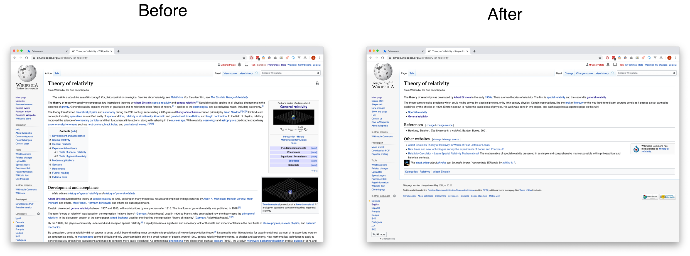

# Wiki Simplify Browser Extension

A Browser extension to show the simplified version of a wikipedia article.

When accessing a wikipedia article like: https://en.wikipedia.org/wiki/Kinetic_energy, we can get a simplified version of it
by changing the url to https://simple.wikipedia.org/wiki/Kinetic_energy.
This allows the get a gist of the topic without going into too much detail initially.

This browser extension simply toggles the article between simplified or normal mode.

